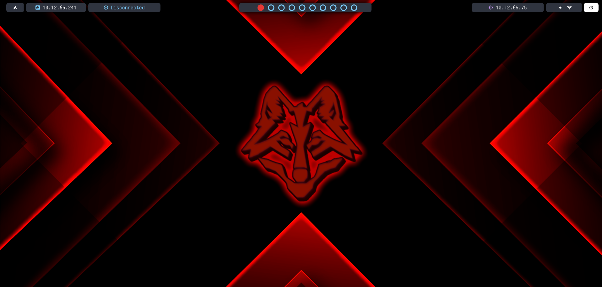

# Customkali2.0_AutoBSPWM

Script automatizado para tu entorno de hacking. La mayor parte del proyecto se recoge del repositorio [kalilifa](https://github.com/Lafassj/KaliLafa), este mod realiza los siguientes cambios:  
* Instala bspwm
* instala polybar
* Instala kitty
* Cambia a zsh
* Instala Oh-My-Zsh + Powerlevel10K
* Instala rofi (lanzador de aplicaciones)
* Instala feh (visor de imagenes)
* Instala colorls (Comando ls con colores bien identificativos)
* Instala batcat (Cat con añadidos, como restaltar el código en distintos lenguajes de programación)
* Instala fuente "Hack Nerd Font"
* Modifica colores de terminal kitty
* Modifica el prompt de powerlevek10K
* Instala un wallpaper personalizado

## Preview del mod


## Instalacion
Introducimos el siguiente comando (NO INTRODUCIRLO COMO ROOT, sino dará PROBLEMAS)
```bash
sudo apt update && git clone https://github.com/glmbxecurity/Autobspwm && cd Autobspwm && chmod +x install.sh && ./install.sh
```  
Cuando termine, nos pedirá elegir un tema. elegimos uno cualquiera y pulsamos **Alt + a**.

Seguidamente , cerramos sesión e iniciamos de nuevo introducimos el siguiente comando (esto reiniciará el equipo)  (NO INTRODUCIRLO COMO ROOT, sino dará PROBLEMAS)

```bash
git clone https://github.com/glmbxecurity/Customkali2.0_AutoBSPWM.git personalizacion && cd personalizacion && chmod +x ./install.sh && ./install.sh
```   
* Al iniciar el equipo cambiamos al entorno BSPWM como en la siguiente imagen:
  
* Listo! a disfrutar de tu nuevo entorno.


## Consideraciones a tener en cuenta
El script está preparado para cambiar el layout del teclado al Español de España. Si no quieres cambiar el layout, simplemente elimina el fichero **keyboard** después de hacer el **git clone** o cambiar el idioma al reiniciar en la pantalla de login  
  
## Set target para hacking
Para establecer un target cuando estamos con un CTF, introducimos el siguiente comando:  


```bash
settarget <ip maquina>
```


# shortcuts
```bash
===========================================================================================================
windows + enter abre terminal 
windows + w cierra terminal
windows + d abre el buscador de aplicaciones
windows hold mover libremente la ventana
windows clic derecho reescalar libremente la ventana
windows + alt + flechas escalar ventana
windows + ctl + flechas mover ventana
control + shift + t abre pestaña en terminal
control shift alt t renombrar pestaña de terminal
control shift w cerrar pestaña de terminal
windows + "1,2,3,4,5,6,7,8,9,0" cambiar de escritorio
windows + shift + "1,2,3,4,5,6,7,8,9,0" cambiar de escritorio la ventana actual al escritorio seleccionado
============================================================================================================
```
## Cambiar wallpaper + Wallpapers adicionales
Si prefieres otro wallpaper, se edita el fichero: ~/.config/bspwm/bspwmrc

 

## Extra  
Si quieres cambiar alguna configuración:  
* Para personalizar los colores de la terminal, se pueden editar los ficheros /home/kali/.config/kitty/kitty.conf  
* Para personalizar los colores del prompt, se puede editar el fichero /home/kali/.p10k.zsh
```
En p10k.zsh los parametros son los siguientes:

  typeset -g POWERLEVEL9K_OS_ICON_FOREGROUND=232 (Linea 187 del fichero)
  typeset -g POWERLEVEL9K_OS_ICON_BACKGROUND=148 (Linea 188 del fichero)
  typeset -g POWERLEVEL9K_OS_ICON_CONTENT_EXPANSION='⭐' (linea 190 del fichero)
  typeset -g POWERLEVEL9K_DIR_BACKGROUND=4 (Linea 217 del fichero)
  typeset -g POWERLEVEL9K_DIR_FOREGROUND=254 (Linea 219 del fichero)
  typeset -g POWERLEVEL9K_DIR_SHORTENED_FOREGROUND=196 (color path prompt)
  typeset -g POWERLEVEL9K_DIR_ANCHOR_FOREGROUND=196 (color primer elemento path prompt)
  

```
## Syntax Highhlighting edit
Si quieres editar el syntax highlighting basta con añadir los parámetros que podemos consultar en el [manual](https://github.com/zsh-users/zsh-syntax-highlighting/blob/master/docs/highlighters/main.md). al final del fichero .zshrc. Un ejemplo:  
```
ZSH_HIGHLIGHT_STYLES[suffix-alias]=fg=blue,underline
ZSH_HIGHLIGHT_STYLES[precommand]=fg=blue,underline
ZSH_HIGHLIGHT_STYLES[arg0]=fg=blue
```

#### Recursos
* [Descargar iconos aquí](https://www.nerdfonts.com/cheat-sheet)  
* **Sacar paleta de colores de powerlevel10k** ``` for i in {0..255}; do print -Pn “%K{$i} %k%F{$i}${(l:3::0:)i}%f “ ${${(M)$((i%6)):#3}:+$’\n’}; done ```
